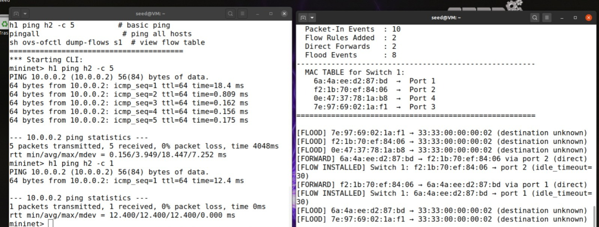
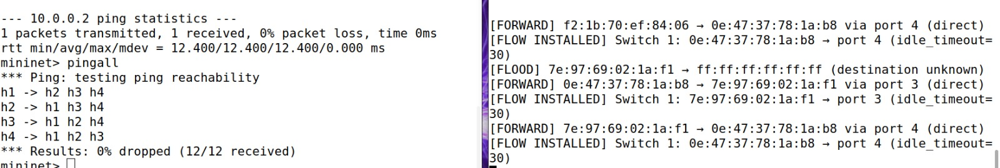
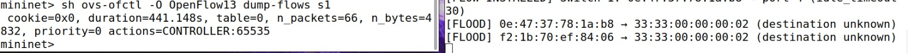
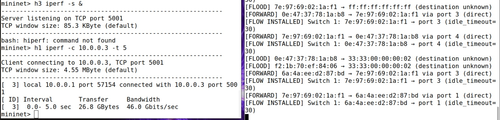
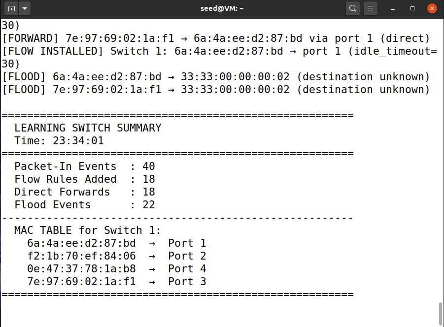

# ryu-mininet-orange-problem
 learning switch implementation for the orange problem
sdn mininet simulation project - orange problem

course: computer networks - ue24cs252b
author srn: pes1ug24cs448

##problem statement
this project implements an sdn-based learning switch solution using mininet and the ryu openflow controller. the goal is to demonstrate controller-switch interaction, match-action flow rule design, and observe network behavior through functional testing.

##topology design
the network is built using mininet and consists of a single open vswitch (s1) connected to four hosts (h1, h2, h3, h4) and a remote ryu controller (c0) running on 127.0.0.1. the hosts are assigned ips from 10.0.0.1 to 10.0.0.4.

controller logic
the controller logic is implemented in learning_switch.py. it manages the network by:

installing a default table-miss flow rule upon switch connection.

handling packet_in events to dynamically learn source mac addresses and their corresponding switch ports.

flooding packets when the destination mac address is unknown.

installing explicit flow rules (with priority 1, idle_timeout=30s, and hard_timeout=120s) when the destination is known, and directly forwarding the packet to the correct port.

##setup and execution steps

step 1: start the ryu controller
open a terminal and run the controller script to begin listening for switch connections:
ryu-manager learning_switch.py

step 2: start the mininet topology
open a second terminal and execute the topology script with sudo privileges:
sudo python3 topology.py

step 3: verify connectivity
in the mininet cli, test reachability between all hosts:
mininet> pingall

step 4: measure throughput
in the mininet cli, start an iperf server on h3 and connect to it from h1:
mininet> h3 iperf -s &
mininet> h1 iperf -c 10.0.0.3 -t 5

step 5: inspect flow rules
in the mininet cli, view the flow table of the switch to confirm rules were installed by the controller:
mininet> sh ovs-ofctl dump-flows s1

##expected output and proof of execution

functional correctness: running the pingall command results in 0% dropped packets (12/12 received), proving the learning switch correctly forwards traffic.

performance observation: the iperf test demonstrates high throughput between hosts (e.g., ~46.0 gbits/sec).

controller monitoring: the ryu terminal outputs a real-time learning switch summary, logging packet-in events, flow rules added, direct forwards, flood events, and the dynamically built mac table.

flow rule validation: dumping the flow table reveals the active match-action rules installed by the controller, complete with packet counts, byte counts, and timeout values.

screenshots capturing the mininet cli testing, iperf output, openflow table dumps, and the ryu controller logs are included in this repository as proof of execution.

##references

mininet walkthrough and documentation (mininet.org)

open vswitch documentation

ryu sdn framework official documentation